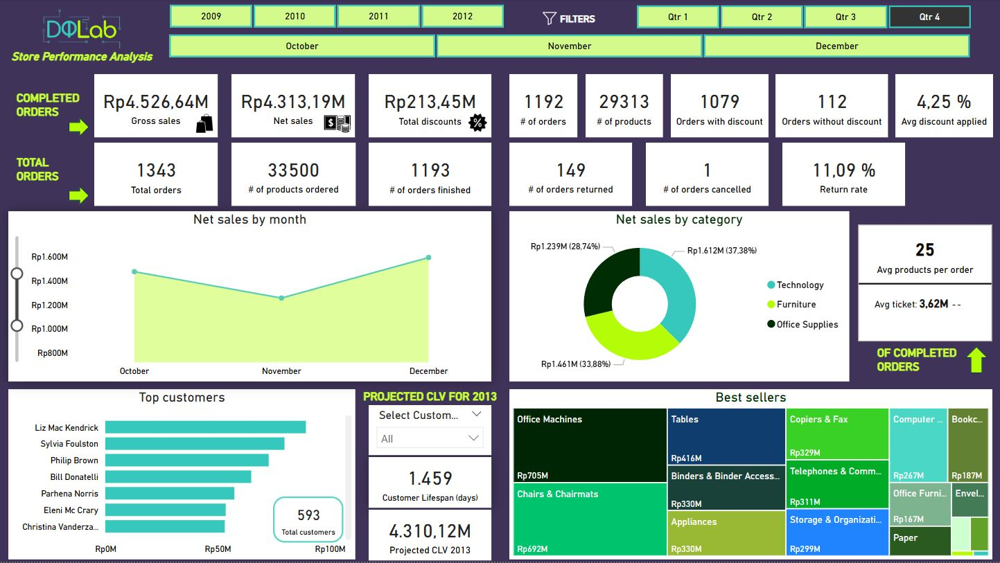
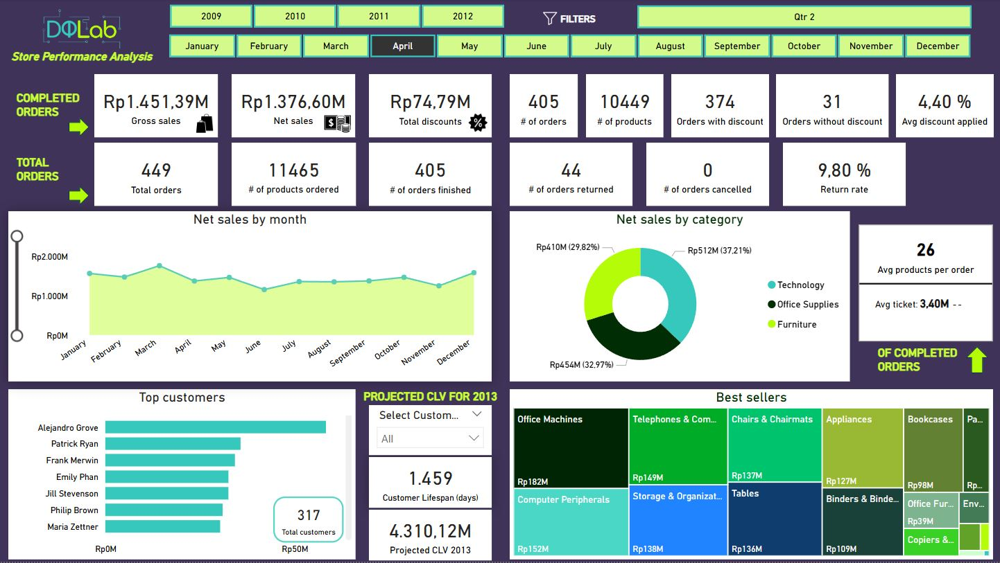
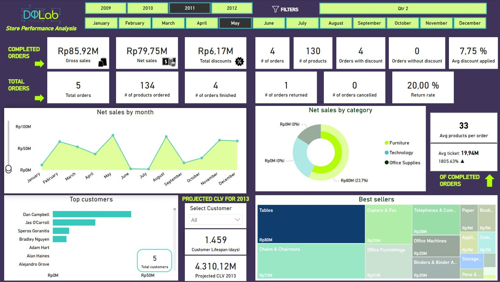

# DQLab Store Analysis


## Descripción

En este proyecto se utiliza un dataset obtenido en **Kaggle** 👉 https://www.kaggle.com/datasets/dhawyfarrasputra/sales-performance-report-dqlab-store.

Este dataset proporciona datos históricos de ventas desde 2009 hasta 2012. Los datos contienen 3 categorías de productos: suministros de oficina, tecnología y muebles. A su vez, cada categoría tiene varia subcategorías. La empresa realiza promociones en forma de descuento.

**Este proyecto incluye:**
1. La revisión de la consistencia de la base de datos y su limpieza, si se necesita, mediante Jupyter Lab.
2. Establecer consideraciones iniciales a tener en cuenta para el desarrollo del proyecto.
3. Un dashboard elaborado en PowerBI donde se realiza un análisis estacional de las ventas netas, se analizan las categorías de producto y productos más rentables y populares, se identifican los clientes más valiosos y su valor estimado de por vida, se analiza el desempeño de los pedidos para evaluar la eficiencia en la gestión de pedidos y la satisfacción del cliente y se analiza el impacto de los descuentos en las ventas.
4. Una hoja de consultas a la base de datos en lenguaje SQL para realizar diferentes comprobaciones de la veracidad de los datos obtenidos en PowerBI.
5. Establecer consideraciones futuras para añadir complejidad al proyecto en el futuro.

## Objetivos

- Evaluar la tendencia de ventas a lo largo de los últimos 3 años.
- Determinar la rentabilidad de las ventas considerando descuento y el volumen de ventas.
- Identificar qué productos y categorías son más rentables y populares.
- Identificar los clientes más valiosos y su comportamiento.
- Determinar el impacto de los descuentos en las ventas.
- Identificar patrones estacionales en las ventas.

## Consideraciones iniciales (IMPORTANTE)

- Para el cálculo de las métricas: Net sales, Gross sales, Total discounts, Avg discount applied, Orders with discount, Orders without discount, Avg products per order, Avg Ticket, Customer lifespan y Projected CLV 2013 se han tenido únicamente en cuenta aquellos pedidos que han sido completados, es decir, aquellos pedidos cuyo valor de campo order_status es "Order Finished".
- Consideraremos los pedidos cuyo valor de campo order_status es "Order Returned" como aquellos pedidos cuyos productos se han añadido al carrito pero no se ha finalizado la compra. Por lo tanto, estos registros no se tienen en cuenta para el cálculo métricas anteriormente mencionadas. La métrica Return rate, en este caso, se tratará del porcentaje de pedidos que no se han finalizado.
- En el caso de los pedidos cuyo valor de campo order_status es "Order Cancelled", ya que se generan dos registros con el mismo order_id: uno con "Order Finished" y otro con "Order Cancelled"; estos registros no se tienen en cuenta en cuenta para el cálculo de las métricas anteriormente mencionadas.
- La métrica Customer lifespan indica la duración de la relación del cliente seleccionado o del conjunto total de clientes con la empresa.
- La métrica Projected CLV 2013 indica el valor estimado a futuro, para el año 2013, del cliente seleccionado o del conjunto total de clientes, es decir, se trata de una estimación de las ventas que se van a generar en el próximo año basándonos en dos métricas: Finished Avg Ticket y Finished Avg Orders Per Day (el promedio del ticket medio y el promedio de pedidos por día), siempre teniendo como condición las anteriores mencionadas sobre lo que consideramos un pedido como válido.

## Consideraciones futuras

Puesto que esta base de datos consta de una única tabla se propone desarrollar una base de datos más completa con las siguientes tablas:
- Tabla de clientes: esta tabla contendrá información detallada de cada cliente (nombre, apellido, edad, estado civil, salario anual, país, localidad, email)
- Tabla de Productos: esta tabla contendrá información detallada de cada producto (producto, precio, coste de venta)

## Descripción del Dataset

**order_id**: número único identificador de pedido.

**order_status**: estado del pedido.
   - finished: pedido con venta finalizada.
   - returned: pedido con productos añadidos a la cesta pero no se ha finalizado la venta.
   - cancelled: pedido cuya venta se ha finalizado previamente pero finalmente ha sido cancelado.

**customer**: nombre y apellido del cliente.

**order_date**: fecha del pedido.

**order_quantity**: cantidad de productos comprados en un pedido en particular.

**sales**: ventas generadas en un pedido en particular, se utiliza como moneda la Rupia Indonesia.

**discount**: porcentaje de descuento aplicado en el pedido.

**discount_value**: ventas multiplicadas por el descuento, se utiliza como moneda la Rupia Indonesia

**product_category**: categoría del producto adquirido.

**product_sub_category**: subcategoría del producto adquirido.

## Cómo Ejecutar el Proyecto
1. Clona el repositorio:
   ```bash
   git clone https://github.com/gescuderh/dqlab-store-analysis.git

2. Navega al directorio del proyecto:
   ```bash
   cd dqlab-store-analysis

4. Instala las dependencias:

   Crea un archivo `requirements.txt` para listar las dependencias del proyecto:

   ```text
   jupyter
   numpy
   pandas 
   os
   seaborn
   matplotlib.pyplot
   missingno
   warnings
   ````
   
   ```bash
   pip install -r requirements.txt
   ```

6. Ejecuta el notebook:
   ```bash
   jupyter notebook notebooks/dqlab-store-analysis.ipynb
   ```

## Ejemplos de vistas del dashboard con filtros aplicados

1. Filtrado por año 2010


En el año 2010 se obtienen unas ventas netas de 4.058,93 millones de Rupias después de aplicar los descuentos por valor de 197,49 millones. En total se registraron 1.393 órdenes con una suma de 34.898 productos, de las cuales se finalizaron 1.248 órdenes y 145 órdenes fueron devueltas, lo que corresponde a una tasa de devoluciones del 10,41% en 2010. Del total de órdenes completadas (1.248), a 1.134 órdenes se les aplicó un descuento que de media fue un 4,19%. La media de productos por órden fue de 25 mientras que el ticket medio fue de 3,25 millones, lo que supone un decrecimiento del 12,30% respecto al ticket medio del año 2009.

En lo que respecta a la parte gráfica, observamos que los meses de mayor venta fueron Enero, Septiembre y Diciembre. La categoría de producto con mayor representación sobre las ventas netas fue Technology (39,18%) y el TOP3 subcategorías de producto con mayor participación en el total de ventas fueron: Office Machines, Chairs & Chairmats y Telephones & Communication. Por último, del total de clientes que compraron en nuestra tienda (624), el cliente con mayor gasto en la tienda fue Karen Carlisle.

3. Filtrado por trimestre 4


Filtrando por el 4º trimestre para el conjunto de los 4 años se obtienen una ventas netas de 4.313,19 millones de Rupias después de aplicar 213,45 millones en descuentos. En el total de los 4 años para este trimestre se registraron 1.343 órdenes con una suma de 33.500 productos, de las cuáles se finalizaron 1.193 órdenes, 149 órdenes fueron devueltas (tasa de retorno del 11,09%) y 1 fue cancelada. Así pues, el total de órdenes completadas fueron 1.192 de las cuales a 1.079 se les aplicó un descuento que de media fue del 4,25%. La media de productos por órden fue de 25 mientras que el ticket medio fue de 3,62 millones.

En lo que respecta a la parte gráfica, observamos que el mes de mayor venta general en el 4º trimestre ha sido Diciembre. La categoría de producto con mayor representación sobre las ventas netas fue Technology (37,38%) y el TOP3 subcategorías de producto con mayor participación en el total de ventas fueron: Office Machines, Chairs & Chairmats y Tables. Por último, del total de clientes que compraron en nuestra tienda (593) en el 4º trimestre, el cliente con mayor gasto fue Liz Mac Kendrick.

5. Filtrado por mes Abril


Filtrando por el mes de Abril para el conjunto de los 4 años se obtienen unas ventas netas de 1.376,60 millones de Rupias después de aplicar 74,79 millones en descuentos. En el total de los 4 años para este mes se registraron 449 órdenes con una suma de 11.465 productos, de las cuáles se finalizaron 405 y 44 órdenes fuero devueltas, lo que supone una tasa de devoluciones del 9,80%. Del total de órdenes completadas (405), en 374 órdenes se aplicó descuento a una media de 4,40%. La media de productos por órden fue de 26 mientras que el ticket medio fue de 3,40 millones.

En lo que respecta a la parte gráfica, observamos que Abril no ha sido uno de los mejores meses en ventas en general. La categoría de producto más destacada sobre el total de ventas es Technology (37,21%) y el TOP3 subcategorías de producto con mayor participación en el total de ventas fueron: Office Machines, Computer Peripherals y Telephones & Communication. En el mes de Abril para el conjunto de los 4 años se registraron 317 clientes siendo el más destacado a nivel de gasto Alejandro Grove.

7. Filtrado por categoría de producto Technology y año 2012


9. Filtrado por subcategoría de producto (Table), año 2011 y mes Mayo



11. Filtrado por cliente (Deborah Brumfield) y año 2011


## EDA (Exploratory Data Analysis)

1. Evaluar la tendencia de ventas a lo largo de los últimos 4 años.
2. Determinar la rentabilidad de las ventas considerando descuento y el volumen de ventas.
3. Identificar qué productos y categorías son más rentables y populares.
4. Identificar los clientes más valiosos y su comportamiento.
5. Determinar el impacto de los descuentos en las ventas.
6. Identificar patrones estacionales en las ventas.

